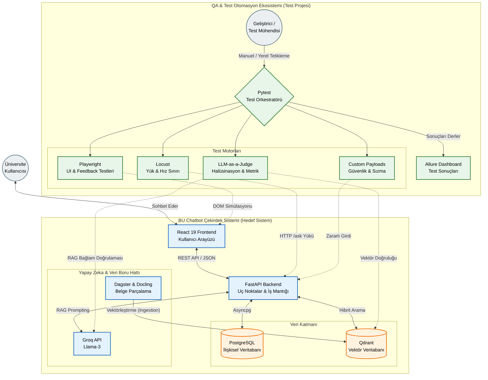

# BU Chatbot - Test Otomasyonu

Bu depo, Antalya Belek Üniversitesi Chatbot sisteminin uçtan uca (E2E), API, siber güvenlik, performans ve Yapay Zeka (LLM) doğruluk metriklerinin test edilmesi için kurulmuş profesyonel ve izole bir test otomasyon altyapısıdır.

## Kullanılan Teknolojiler

- **Test Orkestratörü:** Pytest (`pytest-asyncio`, `pytest-mock`)
- **Arayüz (E2E) Testleri:** Playwright (Python)
- **Performans & Yük Testleri:** Locust
- **Yapay Zeka (RAG) Testleri:** LangChain tabanlı özel "LLM-as-a-Judge" (Hakem LLM) mimarisi (Faithfulness, Answer Relevance, Hit Rate, MRR, Toxicity)
- **Güvenlik Kontrolü & Sızma:** SlowAPI, Pytest Özel SQLi/XSS/Prompt Injection Vektörleri
- **Raporlama Altyapısı:** Allure Report

## Kurulum ve Çalıştırma (Kurulum Kılavuzu)

Test otomasyon projesini yerel makinenizde ayağa kaldırmak için aşağıdaki adımları izleyin:

1. **Sanal Ortamı Oluşturun ve Aktif Edin:**
   python -m venv venv
   .\venv\Scripts\activate # Windows için
   source venv/bin/activate # Linux/Mac için

2. **Gerekli Test Kütüphanelerini İndirin:**
   pip install -r requirements.txt

3. **Kararlı ve Modüler Test Koşumu:**
   Sistemdeki güvenlik duvarlarının test aracını engellememesi ve Groq (LLM) API kotalarının dolup asılsız test hatalarına (Flaky Tests) yol açmaması için testlerin klasör veya modül bazında ayrı ayrı çalıştırılması zorunludur:

   # 1. Birim ve Altyapı Testleri

   pytest tests/unit/ -v

   # 2. Veri Boru Hattı (Pipeline / Chunking) Testleri

   pytest tests/pipeline/ -v

   # 3. API ve Sistem Sağlık Testleri

   pytest tests/api/ -v

   # 4. Siber Güvenlik ve Sızma Testleri (Ayrı ayrı çalıştırılmalıdır)

   pytest tests/security/test_prompt_injection.py -v
   pytest tests/security/test_rate_limit.py -v
   pytest tests/security/test_sql_injection.py -v

   # 5. Yapay Zeka Doğruluk (AI Evaluation) Testleri

   # API limitlerine (Rate Limit) takılmamak için ayrı çalıştırılmalıdır!

   pytest tests/ai_eval/test_eval_integration.py -v
   pytest tests/ai_eval/test_relevance.py -v
   pytest tests/ai_eval/test_ood.py -v
   pytest tests/ai_eval/test_toxicity.py -v
   pytest tests/ai_eval/test_faithfulness.py -v

   # 6. Uçtan Uca Arayüz (E2E - Playwright) Testleri

   # Not: Bu testin çalışması için FastAPI sunucusunun ve React arayüzünün ayakta olması gerekir.

   pytest tests/e2e/ -v

   # 7. Performans ve Yük (Load - Locust) Testleri

   # Sistemin eşzamanlı kullanıcı dayanıklılığını ölçer.

   python -m locust -f tests/performance/locustfile.py

## Sistem Genel Mimarisi

Aşağıdaki diyagramda, geliştirdiğimiz QA test otomasyon ekosisteminin, Yusuf tarafından geliştirilen ana chatbot çekirdek sistemi (React, FastAPI, PostgreSQL, Qdrant) ile nasıl entegre olduğu ve hangi katmanı nasıl denetlediği modellenmiştir:

